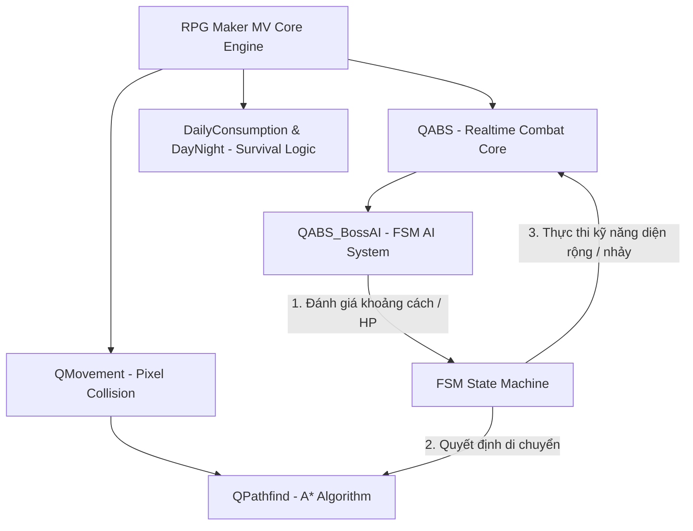

# Game Nhập Vai Hành Động Sinh Tồn Zombie 2D Thời Gian Thực

[](https://www.rpgmakerweb.com/products/rpg-maker-mv)
[](https://developer.mozilla.org/en-US/docs/Web/JavaScript)
[]()

Dự án nghiên cứu và phát triển game nhập vai hành động 2D (Action RPG) đề tài sinh tồn zombie phục vụ cho **Đồ án tốt nghiệp / Khóa luận tốt nghiệp**. Trò chơi được xây dựng trên nền tảng engine **RPG Maker MV** kết hợp với kiến trúc lập trình JavaScript tùy biến mở rộng.

---

## 📌 Mục lục
1. [Giới thiệu & Mục tiêu Đồ án](#1-giới-thiệu--mục-tiêu-đồ-án)
2. [Các Tính năng Nổi bật](#2-các-tính-năng-nổi-bật)
3. [Kiến trúc Hệ thống](#3-kiến-trúc-hệ-thống)
4. [Cấu trúc Thư mục Dự án](#4-cấu-trúc-thư-mục-dự-án)
5. [Yêu cầu Hệ thống & Công cụ](#5-yêu-cầu-hệ-thống--công-cụ)
6. [Hướng dẫn Cài đặt & Chạy Game](#6-hướng-dẫn-cài-đặt--chạy-game)
7. [Hướng dẫn Điều khiển](#7-hướng-dẫn-điều-khiển)

---

## 1. Giới thiệu & Mục tiêu Đồ án

### Giới thiệu
Trò chơi lấy bối cảnh một trường học bị cô lập trong đại dịch zombie. Người chơi nhập vai nhân vật chính tìm cách sinh tồn tại căn cứ, quản lý tài nguyên ăn uống hàng ngày, thực hiện các nhiệm vụ giải cứu đồng đội ngoài vùng an toàn và đối đầu với thực thể Boss đột biến biến dị để mở lối thoát thân.

### Mục tiêu Nghiên cứu và Phát triển
* **Tích hợp Hệ thống Chiến đấu Thời gian thực (ABS):** Loại bỏ cơ chế chiến đấu theo lượt mặc định, triển khai đánh trực tiếp trên bản đồ bằng vũ khí cận chiến và súng tầm xa.
* **Cơ chế Pixel Movement & Thuật toán A\*:** Nâng cấp từ di chuyển theo ô vuông truyền thống lên di chuyển tự do theo pixel, áp dụng thuật toán **A\* (A-Star)** tối ưu hóa tìm đường chéo của quái vật xung quanh chướng ngại vật phức tạp.
* **Hệ thống AI Boss FSM (Finite State Machine):** Xây dựng bộ não cho Boss có khả năng tự động đánh giá khoảng cách với người chơi và thi triển chuỗi chiêu thức diện rộng telegraphed phức tạp (như chiêu nhảy nện Jump Attack có hiển thị vòng cảnh báo đỏ).
* **Cơ chế Sinh tồn Thực tế:** Xây dựng hệ thống thể lực (Stamina HUD), chu kỳ Ngày/Đêm (ảnh hưởng đến thuộc tính sức mạnh zombie), hệ thống tiêu thụ thực phẩm cuối ngày và hồi máu/sát thương đói khát.

---

## 2. Các Tính năng Nổi bật

* **Thanh Máu Quái Vật (HP Gauges):** Hiển thị trực tiếp trên đầu kẻ địch giúp người chơi kiểm soát trận chiến dễ dàng.
* **Thay Đổi Trang Bị (Weapon Skins):** Nhân vật tự động thay đổi ngoại hình hiển thị (spritesheet) và bộ kỹ năng tương thích khi đổi vũ khí (Dao cầm tay $\rightarrow$ cận chiến, Súng trường $\rightarrow$ bắn đạn tầm xa).
* **Quản lý Thể lực (Stamina Manager):** Chạy nhanh (Dash) tiêu hao thể lực, thể lực tự động hồi phục khi đi bộ hoặc đứng yên, tự động dừng chạy khi cạn kiệt.
* **HUD Tự Động Ẩn (Dynamic HUD):** Giao diện máu và thể lực tự động giảm độ mờ (opacity) và ẩn đi khi kích hoạt hội thoại nói chuyện với NPC để tránh che khuất nội dung cốt truyện.
* **Xác Zombie (Corpse System):** Khi zombie bị tiêu diệt, xác sẽ nằm cố định trên đất tại hướng bị tiêu diệt và cho phép đi xuyên qua. Xác zombie tự biến mất và hồi sinh khi kết thúc ngày.

---

## 3. Kiến trúc Hệ thống

Hệ thống được phát triển theo mô hình hướng đối tượng, can thiệp và ghi đè các hàm cốt lõi của RPG Maker MV thông qua JavaScript.



---

## 4. Cấu trúc Thư mục Dự án

Dưới đây là sơ đồ bố trí các file quan trọng trong kho lưu trữ (repository) này:

```text
├── .kiro/                      # Tài liệu hướng dẫn thiết lập hệ thống game
├── audio/                      # Tài nguyên âm thanh (BGM, BGS, SE, ME)
├── data/                       # Cơ sở dữ liệu JSON (Bản đồ, kỹ năng, kẻ địch...)
│   ├── MapInfos.json           # Danh sách và phân cấp các map trong game
│   ├── Skills.json             # Khai báo kỹ năng QABS & Sequencer
│   └── System.json             # Cấu hình hệ thống game chung
├── img/                        # Tài nguyên đồ họa (Chacter, picture, tilesets...)
│   └── pictures/               # Ảnh hiệu ứng kỹ năng, warning circle
├── js/                         # Mã nguồn JavaScript của game
│   ├── plugins/                # Danh mục các Plugin mở rộng của game
│   │   ├── QABS.js             # Lõi hệ thống chiến đấu thời gian thực
│   │   ├── QABS_BossAI.js      # Máy trạng thái AI của Boss (FSM)
│   │   ├── DailyConsumption.js # Cơ chế đói khát tiêu thụ thực phẩm hàng ngày
│   │   ├── DayNightCycle.js    # Chu kỳ ngày đêm & hệ thống xác zombie
│   │   └── QPathfind.js        # Thuật toán tìm đường A* cho quái vật
│   ├── main.js                 # Điểm khởi chạy cấu hình game
│   └── plugins.js              # Khai báo và thứ tự kích hoạt các plugin
├── GAME_FEATURES_SUMMARY.md    # Bản tóm tắt đầy đủ tính năng và gameplay
├── Game.rpgproject             # File quản lý dự án trên phần mềm RPG Maker MV
├── index.html                  # File HTML5 chính khởi chạy game trên trình duyệt
└── package.json                # Cấu hình NW.js (đóng gói chạy desktop app)
```

---

## 5. Yêu cầu Hệ thống & Công cụ

* **Phát triển / Đóng gói:**
  * RPG Maker MV (Phiên bản khuyến nghị: **v1.6.1** hoặc **v1.6.2**).
  * Trình soạn thảo mã nguồn: Visual Studio Code.
* **Khởi chạy ứng dụng:**
  * Máy tính chạy hệ điều hành Windows 7/8/10/11 (32-bit hoặc 64-bit).
  * Trình duyệt hỗ trợ công nghệ đồ họa WebGL (Google Chrome, Microsoft Edge, Firefox...).
  * Node.js (Tùy chọn: Dùng để chạy máy chủ nội bộ phục vụ test game nhanh).

---

## 6. Hướng dẫn Cài đặt & Chạy Game

### Cách 1: Mở dự án bằng phần mềm RPG Maker MV
1. Cài đặt phần mềm **RPG Maker MV** trên máy tính.
2. Clone repository này về máy hoặc giải nén file mã nguồn.
3. Chọn **File -> Open Project...** trong RPG Maker.
4. Trỏ tới thư mục mã nguồn và mở file **`Game.rpgproject`**.
5. Nhấn phím **Ctrl + R** hoặc click biểu tượng nút Play màu xanh trên thanh công cụ để bắt đầu chơi thử nghiệm.

### Cách 2: Chạy trực tiếp qua Local Server (Môi trường Web)
Do trình duyệt Chrome thắt chặt chính sách CORS khi mở trực tiếp file `index.html` từ ổ đĩa, bạn cần chạy game thông qua một máy chủ local:
1. Mở thư mục dự án bằng phần mềm **Visual Studio Code**.
2. Cài đặt extension **Live Server** (của nhà phát triển *Ritwick Dey*).
3. Click chuột phải vào file **`index.html`** ở thanh Sidebar $\rightarrow$ chọn **Open with Live Server**.
4. Game sẽ chạy ổn định trên trình duyệt của bạn qua đường dẫn `http://127.0.0.1:5500/index.html`.

---

## 7. Hướng dẫn Điều khiển

* **Di chuyển:** Sử dụng tổ hợp phím **WASD** để di chuyển nhân vật tự do 360 độ.
* **Chạy nhanh (Dash):** Giữ phím **Shift** khi đang di chuyển (tiêu hao thanh thể lực SP).
* **Tấn công thường / Bắn súng:** Nhấn **`Chuột trái`** (tự động đổi cơ chế chém cận chiến/bắn đạn theo trang bị hiện tại).
* **Tương tác (Nói chuyện, Nhặt đồ, Mở cửa):** Đứng gần mục tiêu và nhấn phím **Space** hoặc **Enter**.
* **Mở Menu chính (Túi đồ, Lưu game):** Nhấn phím **Esc** hoặc phím **X**.
